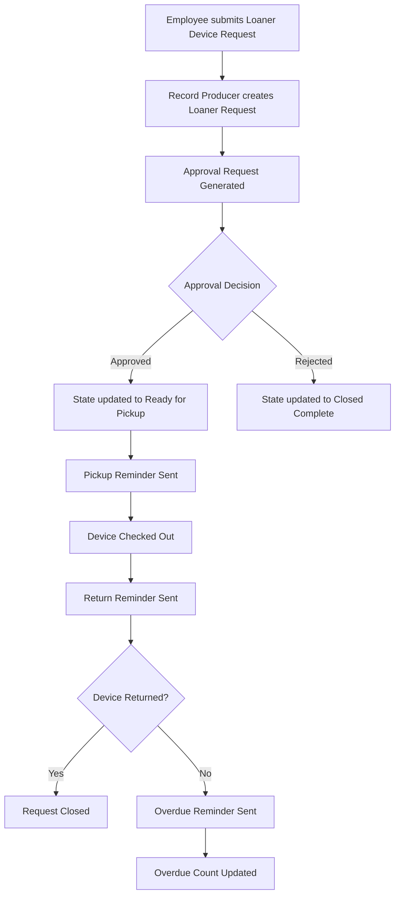
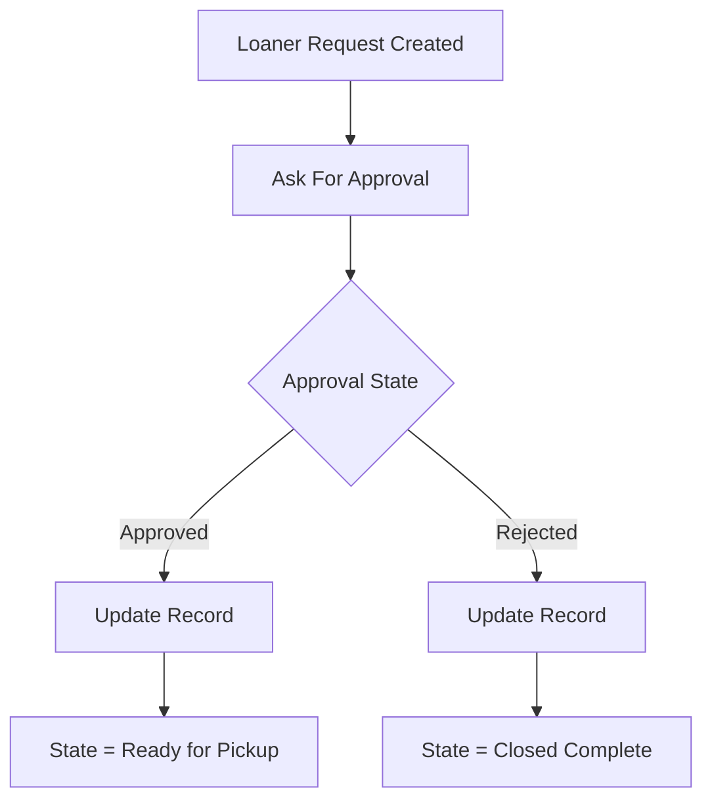
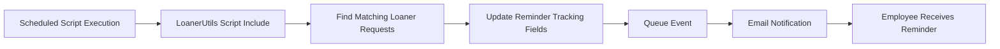
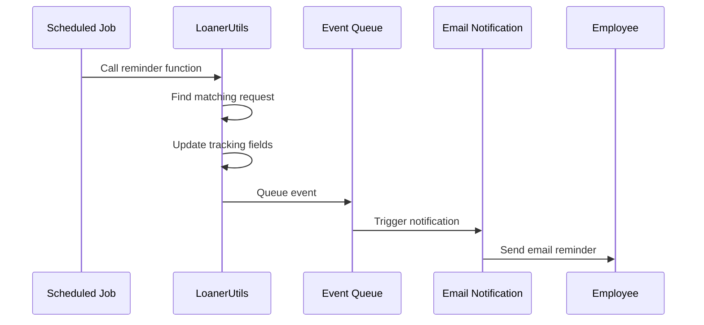
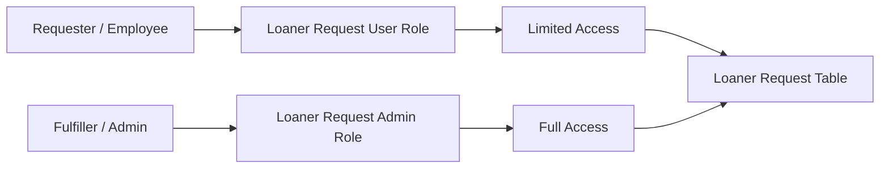
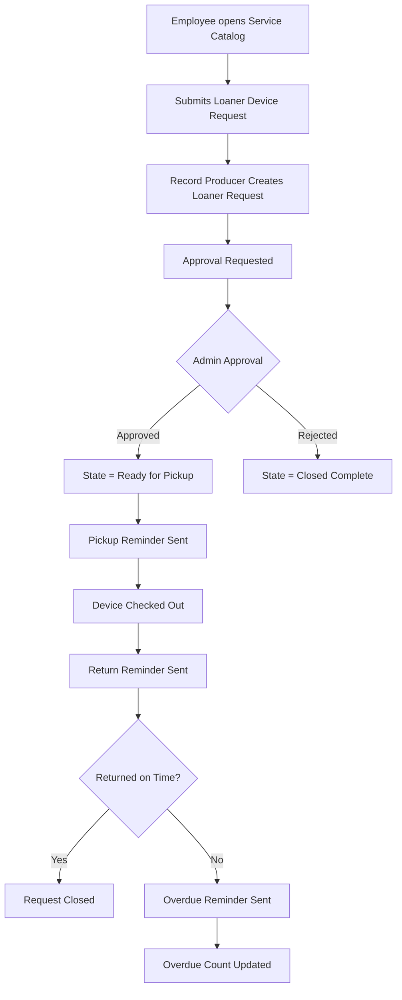

# Loaner Request Management System

A ServiceNow-based Loaner Request Management application designed to manage temporary device requests, approval routing, asset allocation, pickup reminders, return reminders, and overdue notifications.

This project demonstrates end-to-end ServiceNow application development using custom tables, Service Catalog, Record Producers, Variable Sets, Flow Designer, Script Includes, Scheduled Script Executions, Event Registrations, Email Notifications, ACLs, and GitHub source control.

---

## Project Overview

The Loaner Request Management System allows employees to request temporary loaner devices through the Service Catalog. Once submitted, the request is automatically converted into a Loaner Request record, routed for approval, and tracked through the complete device lifecycle.

The application supports automated status updates, approval-based processing, reminder notifications, and overdue tracking to reduce manual follow-ups and improve visibility into device issuance and return processes.

---

## Business Problem

Organizations often provide temporary devices such as laptops, monitors, tablets, or docking stations to employees. Without automation, this process can become difficult to track because teams must manually manage:

* Request submission
* Device allocation
* Approval decisions
* Pickup communication
* Return reminders
* Overdue follow-ups
* Request status tracking

This application solves that problem by automating the complete loaner device request lifecycle.

---

## Key Features

* Employee self-service request submission through Service Catalog
* Record Producer to create Loaner Request records directly
* Reusable Variable Set for request data collection
* Approval workflow using Flow Designer
* Automatic request state updates after approval or rejection
* Configuration Item mapping for device tracking
* Pickup reminder automation
* Return reminder automation
* Overdue reminder automation
* Event-driven email notifications
* Script Include for reusable server-side logic
* Scheduled Script Executions for reminder processing
* Overdue count and last overdue reminder tracking
* Role-based access control using ACLs
* GitLab source control integration
* Professional README documentation with architecture diagrams

---

## Technologies Used

| Area                    | ServiceNow Components                                             |
| ----------------------- | ----------------------------------------------------------------- |
| Application Development | Studio, Custom Application, Custom Tables                         |
| Service Catalog         | Catalog Item, Record Producer, Variable Set, Catalog Variables    |
| Automation              | Flow Designer, Approval Action, Update Record Action              |
| Server-side Logic       | Script Includes, GlideRecord, Scheduled Script Executions         |
| Notifications           | Event Registry, Event Queue, Email Notifications                  |
| Security                | Roles, Groups, ACLs                                               |
| Data Model              | Task Extension, Configuration Item Reference, Custom Fields       |
| Source Control          | GitLab, Branching, Commits                                        |
| Testing                 | Manual workflow testing, Event Log verification, Approval testing |

---

## Application Architecture

```mermaid
flowchart LR
    A[Employee] --> B[Service Catalog]
    B --> C[Record Producer]
    C --> D[Loaner Request Record]
    D --> E[Approval Workflow]
    E --> F[Request Status Update]
    F --> G[Pickup / Return Process]
    G --> H[Scheduled Jobs]
    H --> I[LoanerUtils Script Include]
    I --> J[Event Queue]
    J --> K[Email Notifications]
```



---

## Request Lifecycle



---

## Service Catalog Design

The application includes a Service Catalog experience for employees to request loaner devices.

### Catalog Components

| Component                | Purpose                                      |
| ------------------------ | -------------------------------------------- |
| Service Catalog Category | Groups loaner-related catalog items          |
| Catalog Item             | Provides a request entry point for employees |
| Record Producer          | Creates Loaner Request records directly      |
| Variable Set             | Reuses common request variables              |
| Catalog Variables        | Collect request details from the user        |

---

## Variable Set

A reusable Variable Set was created to collect loaner request details.

### Variable Set Name

```text
Loaner Device Request Variables
```

### Variables Included

| Order | Variable               | Type                | Purpose                                      |
| ----: | ---------------------- | ------------------- | -------------------------------------------- |
|   100 | Requested For          | Reference → User    | Identifies the employee receiving the device |
|   200 | Configuration Item     | Reference → CMDB CI | Tracks the selected loaner device            |
|   300 | Item Type              | Select Box          | Captures the type of device requested        |
|   400 | Start Date             | Date/Time           | Defines the pickup/start date                |
|   500 | End Date               | Date/Time           | Defines the expected return date             |
|   600 | Pickup Location        | Select Box          | Captures the pickup location                 |
|   700 | Business Justification | Multi Line Text     | Captures the reason for the request          |

---

## Record Producer

The Record Producer is used to create Loaner Request records directly from the Service Catalog.

### Record Producer Purpose

```text
Employee fills catalog form
        ↓
Record Producer runs
        ↓
Loaner Request record is created
        ↓
Approval workflow is triggered
```

### Field Mapping

| Catalog Variable       | Loaner Request Field |
| ---------------------- | -------------------- |
| Requested For          | Requested For        |
| Configuration Item     | Configuration Item   |
| Item Type              | Item Type            |
| Start Date             | Start Date           |
| End Date               | End Date             |
| Pickup Location        | Location to be used  |
| Business Justification | Description          |

### Producer Script

```javascript
current.requested_for = producer.requested_for;
current.cmdb_ci = producer.configuration_item;
current.item_type = producer.item_type;
current.start_date = producer.start_date;
current.end_date = producer.end_date;
current.location_to_be_used = producer.pickup_location;
current.description = producer.business_justification;

current.short_description =
    "Loaner " + producer.item_type + " requested for " + producer.requested_for.getDisplayValue();

current.approval = 'requested';
```

---

## Approval Workflow

The application includes an approval workflow built using Flow Designer.

### Approval Flow



### Approval Behavior

| Approval Result | System Action                                    |
| --------------- | ------------------------------------------------ |
| Approved        | Updates Loaner Request state to Ready for Pickup |
| Rejected        | Updates Loaner Request state to Closed Complete  |

The approval workflow was tested successfully by submitting a request through the Record Producer, approving the generated approval record, and confirming that the Loaner Request state changed to Ready for Pickup.

---

## Reminder Automation

The application includes three automated reminder processes:

1. Pickup Reminder
2. Return Reminder
3. Overdue Reminder

These reminders are handled using Scheduled Script Executions, the LoanerUtils Script Include, Event Registrations, and Email Notifications.

---

## Reminder Processing Architecture



---

## Scheduled Script Executions

| Scheduled Job       | Purpose                                              |
| ------------------- | ---------------------------------------------------- |
| Loaner Item Pick Up | Sends pickup reminders for requests ready for pickup |
| Loaner Item Return  | Sends return reminders for checked-out devices       |
| Loaner Item Overdue | Sends overdue reminders for devices past return date |

### Pickup Reminder Job

```javascript
var loanerUtils = new LoanerUtils();
var reminders = loanerUtils.getNullPickupReminders();

for (var i = 0; i < reminders.length; i++) {
    loanerUtils.sendPickupReminder(reminders[i]);
}
```

### Return Reminder Job

```javascript
var loanerUtils = new LoanerUtils();
var reminders = loanerUtils.getNullReturnReminders();

for (var i = 0; i < reminders.length; i++) {
    loanerUtils.sendReturnReminder(reminders[i]);
}
```

### Overdue Reminder Job

```javascript
var loanerUtils = new LoanerUtils();
var overdueRequests = loanerUtils.getOverdueRequests();

for (var i = 0; i < overdueRequests.length; i++) {
    loanerUtils.sendOverdueReminder(overdueRequests[i]);
}
```

---

## Script Include

A Script Include named `LoanerUtils` was used to centralize reusable reminder logic.

### Purpose of LoanerUtils

The Script Include avoids duplicate logic by providing reusable functions for:

* Finding records that need pickup reminders
* Sending pickup reminders
* Finding records that need return reminders
* Sending return reminders
* Finding overdue requests
* Sending overdue reminders
* Updating reminder tracking fields
* Queueing events for notifications

### Key Functions

| Function                   | Purpose                                                                 |
| -------------------------- | ----------------------------------------------------------------------- |
| `getNullPickupReminders()` | Finds Ready for Pickup requests that have not received pickup reminders |
| `sendPickupReminder()`     | Updates pickup reminder field and queues pickup event                   |
| `getNullReturnReminders()` | Finds checked-out requests that need return reminders                   |
| `sendReturnReminder()`     | Updates return reminder field and queues return event                   |
| `getOverdueRequests()`     | Finds checked-out requests past the return date                         |
| `sendOverdueReminder()`    | Updates overdue count, last overdue reminder, and queues overdue event  |

---

## Event-Driven Notification Design

The application uses events to separate business logic from email notification logic.



---

## Event Registrations

| Event Name                   | Purpose                         |
| ---------------------------- | ------------------------------- |
| `x_cdltd_loaner_r_0.pickUp`  | Triggers pickup reminder email  |
| `x_cdltd_loaner_r_0.return`  | Triggers return reminder email  |
| `x_cdltd_loaner_r_0.overdue` | Triggers overdue reminder email |

---

## Email Notifications

| Notification        | Trigger                    |
| ------------------- | -------------------------- |
| Loaner Item Pick Up | Triggered by pickup event  |
| Loaner Item Return  | Triggered by return event  |
| Loaner Item Overdue | Triggered by overdue event |

### Notification Recipients

The email notifications are sent to the employee selected in the Requested For field.

---

## Overdue Tracking

The overdue reminder process updates two tracking fields:

| Field                 | Purpose                                           |
| --------------------- | ------------------------------------------------- |
| Last Overdue Reminder | Stores the last time an overdue reminder was sent |
| Overdue Count         | Tracks how many overdue reminders were sent       |

This allows the application to track repeat reminders and support future escalation logic.

---

## Request State Management

The application tracks the request lifecycle using state values.

| State            | Meaning                                                   |
| ---------------- | --------------------------------------------------------- |
| Reserved         | A device has been selected or reserved                    |
| Ready for Pickup | The request has been approved and is ready for collection |
| Checked Out      | The employee has borrowed the device                      |
| Closed Complete  | The request has been completed or rejected                |

---

## Business Rule

A Business Rule was implemented to automatically update the Loaner Request state when a Configuration Item is assigned.

### Purpose

When a fulfiller assigns a specific loaner device, the request automatically moves to the Reserved state.

### Logic

```javascript
(function executeRule(current, previous /*null when async*/) {

    current.state = 14; // Reserved

})(current, previous);
```

---

## Security Model

The application uses roles, groups, and ACLs to control access.



### Security Components

| Component  | Purpose                                                |
| ---------- | ------------------------------------------------------ |
| User Role  | Allows employees to create and view relevant requests  |
| Admin Role | Allows fulfillers/admins to manage all loaner requests |
| Groups     | Assign roles to users                                  |
| ACLs       | Enforce table and field-level security                 |

---

## Application Properties

Application properties were used to make reminder timing configurable instead of hardcoding values.

| Property              | Purpose                                 |
| --------------------- | --------------------------------------- |
| Pickup lead time      | Controls when pickup reminders are sent |
| Return reminder time  | Controls when return reminders are sent |
| Overdue reminder time | Controls overdue reminder frequency     |

This makes the application easier to maintain because admins can adjust reminder timing without modifying scripts.

---

## Testing Completed

The following functionality was tested successfully:

* Record Producer form submission
* Variable Set rendering in the catalog form
* Loaner Request record creation
* Catalog variable to table field mapping
* Approval record generation
* Approval action changing state to Ready for Pickup
* Pickup reminder event generation
* Return reminder event generation
* Overdue reminder processing
* Overdue count update
* Last overdue reminder update
* Email notification event triggering
* GitLab commit and branch workflow

---

## End-to-End Process



---

## Source Control

The application is maintained using GitLab source control.

### Git Practices Used

* Feature branch creation
* Meaningful commit messages
* Source control integration from ServiceNow Studio
* Commit tracking for major features

### Example Commit Messages

```text
Implemented pickup, return, and overdue reminder notifications
Implemented Loaner Request approval workflow
Implemented Service Catalog request and approval workflow
```

---

## Skills Demonstrated

This project demonstrates practical hands-on experience with:

* ServiceNow Application Development
* Service Catalog configuration
* Record Producer development
* Variable Sets and catalog variables
* Flow Designer approvals
* Server-side scripting
* Script Includes
* GlideRecord usage
* Scheduled Script Executions
* Event-driven notifications
* Email Notification configuration
* Role-based security
* ACL configuration
* Custom table development
* Source control with GitLab
* End-to-end process automation

---

## Project Outcome

This project evolved from a basic Loaner Request application into a complete ServiceNow request management solution with catalog-based request submission, approval routing, automated state management, scheduled reminder processing, event-driven notifications, and source control integration.

The final application demonstrates how multiple ServiceNow platform capabilities can work together to automate a real-world enterprise workflow.
