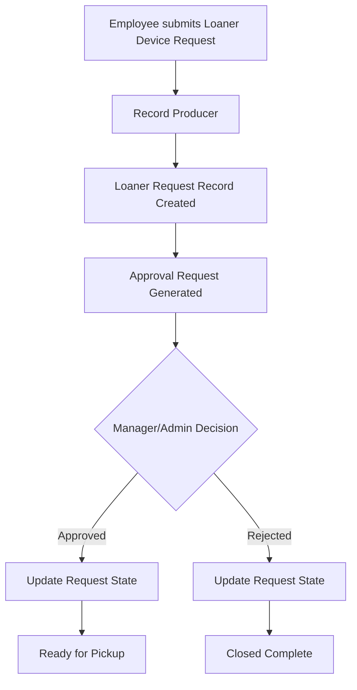

# Loaner Request Management System

A ServiceNow application designed to streamline the management of employee loaner equipment requests, approvals, pickups, returns, and overdue tracking through automated workflows and notifications.

## Overview

The Loaner Request Management System helps organizations efficiently manage temporary equipment allocation by providing a centralized platform for request submission, approval processing, asset tracking, and automated communication.

The application reduces manual effort by automating key processes such as request approvals, pickup reminders, return notifications, and overdue alerts.

---

## Features

### Request Management

* Submit loaner equipment requests
* Track request status in real time
* Maintain request history

### Approval Workflow

* Automated approval routing
* Manager approval process
* Status tracking throughout the lifecycle

### Pickup & Return Tracking

* Equipment pickup scheduling
* Return date management
* Lifecycle visibility

### Automated Notifications

* Pickup reminder emails
* Return reminder notifications
* Overdue equipment alerts
* Event-driven email communication

### Administration

* Role-based access control
* System properties configuration
* Application modules for administration and monitoring

---

## Technologies Used

* ServiceNow App Engine Studio
* Flow Designer
* Business Rules
* Script Includes
* Scheduled Script Executions
* Event Management
* Email Notifications
* Access Controls (ACLs)

---

## Key Components

### Custom Tables

* Loaner Request
* Loaner Task

### Automation

* Approval Flow
* Pickup Reminder Jobs
* Return Reminder Jobs
* Overdue Notification Jobs

### Security

* Admin Role
* User Role
* Access Control Rules

---

## Project Objectives

* Improve loaner equipment tracking
* Reduce manual follow-up efforts
* Automate communication processes
* Increase visibility into request lifecycle
* Enhance operational efficiency

## Author

**Tanmay Sawant**

ServiceNow Certified System Administrator (CSA)
ServiceNow Certified Application Developer (CAD)

---

## Development Log

### 24 Jun 2026
- Configured return and overdue reminder notifications.
- Implemented and tested pickup, return, and overdue scheduled jobs.
- Fixed overdue reminder processing and record updates.
- Verified event generation and email delivery for reminder notifications.

### 25 Jun 2026
- Created a Service Catalog item for Loaner Device Requests.
- Designed reusable Variable Set and catalog variables.
- Implemented a Record Producer to create Loaner Request records.
- Mapped catalog variables to Loaner Request fields.
- Built and tested the approval workflow for loaner requests.
- Automated request state updates after approval or rejection.

#### Loaner Device Request Workflow

